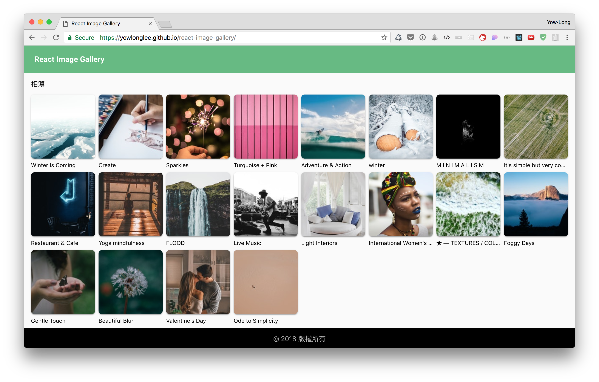
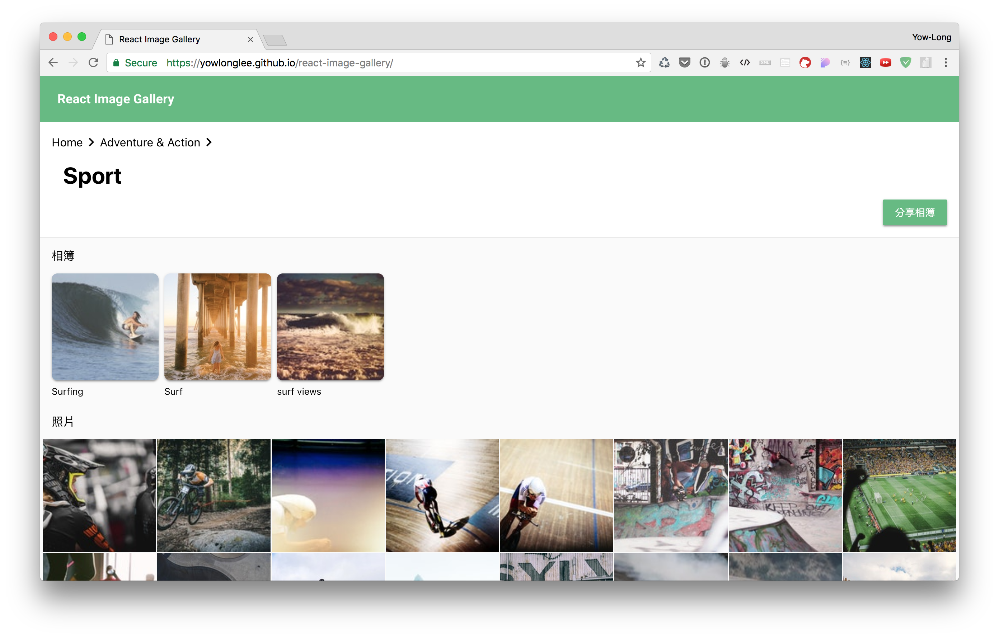

# React Image Gallery
An [Unsplash.com](https://unsplash.com/) collection and photo viewer built with React. 

## About
While I was learning React.js, I was looking for something to do to test my React knowledge. So I came up with the idea of making an online album kinda like Google Photo. You can browse through Unsplash’s photo collections and view hight quality photos in an easy-to-use slides UI.

This project uses Material Design as its design language. Supports RWD and IE 11.

## Screenshots
The home screen

Browsing Unsplash collections in album screen

View high-quality photos in photo slides


## Built With
- React
- [React Toolbox](https://github.com/react-toolbox/react-toolbox)
- Webpack
- Unsplash API

## Features
* Browse through Unsplash.com photo collections
* Share links of interesting albums and photos with one click
* View high quality photos in slides UI
* Support IE 11

## Installation
1. Download the Zip file and extract to a folder.

2. Install all the dependency packages.
```
$ yarn install
```

3. Watch changes in `src` folder
```
$ yarn start
```

4. Compile `bundle.min.js` file
```
$ yarn build -p
```

## API Reference
[Unsplash API](https://unsplash.com/developers)

## Contribute
[Akash Nimare’s article](https://medium.com/@meakaakka/a-beginners-guide-to-writing-a-kickass-readme-7ac01da88ab3) inspired me to write this README

## License
This project is licensed under the MIT License
